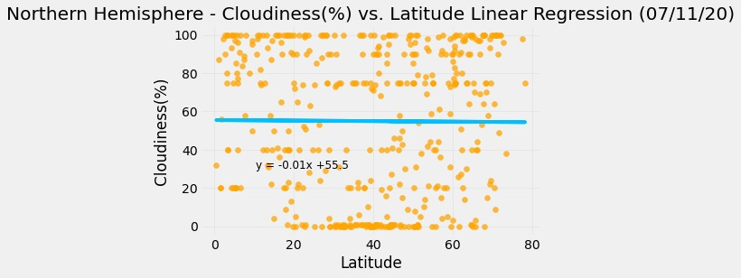

**The Plot Analysis Measuring Weather Data**

This random dataset includes 428 cities in  northern hemisphere and 168 cities in southern hemisphere have that have been compiled and analyzed.  This assigment includes scatter plots for the following criteria:

# Python APIs and Weather Data Graphs Analysis

- Northern Hemisphere - Temperature (F) vs. Latitude

- Northern Hemisphere - Cloudiness (%) vs. Latitude

- Southern Hemisphere - Temperature (F) vs. Latitude

- Cities in the Northern Hemisphere - Wind Speed (mph) vs. Latitude

- Northern Hemisphere - Humidity (%) vs. Latitude

- Southern Hemisphere - Temperature (%) vs. Latitude

